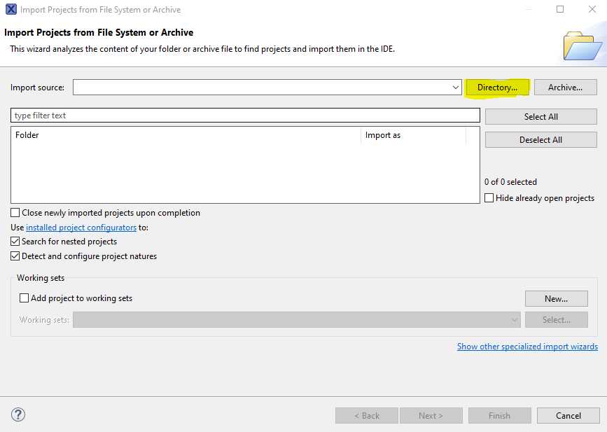
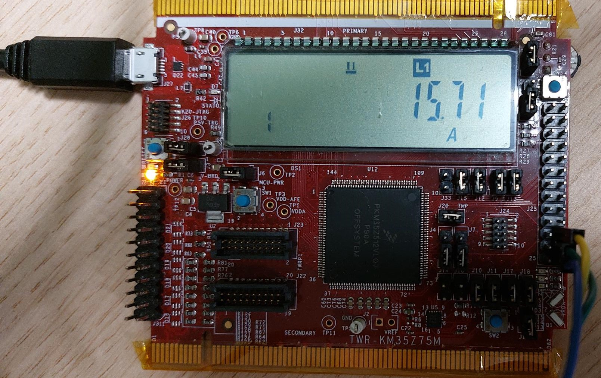

# NXP Application Code Hub

## NXP KM metrology

NXP KM metrology software has two use cases:
- it calculates the charging parameters (current, voltage and power) of an electric vehicle (EV) by using current and voltage samples stored in memory
- it serves as an Analog Front End (AFE) sending data over SPI

In both cases, current values are adjusted by rotating the potentiometer.

#### Boards: TWR-KM35Z75M
#### Categories: Analog Front End, Industrial
#### Peripherals: DISPLAY, I2C, ADC, SPI, UART
#### Toolchains: MCUXpresso IDE

## Table of Contents
1. [Software](#step1)
2. [Hardware](#step2)
3. [Setup](#step3)
4. [Results](#step4)
5. [Support](#step5)
6. [Release Notes](#step6)

## 1. Software
- [MCUXpresso IDE v11.9.1 or later](https://www.nxp.com/design/design-center/software/development-software/mcuxpresso-software-and-tools-/mcuxpresso-integrated-development-environment-ide:MCUXpresso-IDE)
- SDK_2_15_000_TWR-KM35Z75M for TWR-KM35Z75M

## 2. Hardware
Mandatory hardware:
- TWR-KM35Z75M board
- a board with exposed UART and SPI interfaces

>**Note**: EVSE-SIG-BRD1X/2X is used in this document to exemplify hardware connections. If you are using another board, check the documentation and schematic to adapt the wiring.

## 3. Setup

### 3.1 Hardware assembly

To use TWR-KM35 for its metrology capabilities, you need only a UART connection between the TWR-KM35 and the EVSE-SIG-BRD1X/EVSE-SIG-BRD2X (or any other board), as illustrated in the following image.

To use TWR-KM35 board as an AFE, you must use SPI interface. The UART connection is optional. The connections between the TWR-KM35 and the EVSE-SIG-BRD2X (or any other board) are illustrated in the following image.

Connect a microUSB cable between you personal computer and J27 connector on TWR-KM35 to power on the board.

To power on the EVSE-SIG-BRD1X/EVSE-SIG-BRD2X, place J2 on position 1-2 and connect a 5V power supply to J1 barrel connector. If you are not using EVSE-SIG-BRD1X/EVSE-SIG-BRD2X, check the schematic of the corresponding board for powering options.

### 3.2 Software setup and flashing

1. Clone the [APP-CODE-HUB/dm-nxp-km-metrology](https://github.com/nxp-appcodehub/dm-nxp-km-metrology)
2. Import the project from filesystem or archive

3. After importing the project, click on it in the workspace to select it, then click on the hammer button to build it
4. To flash the project, go to Quickstart Panel and select _Debug with LinkServer probes_. When the debugger gets to main() function, click on _Resume All Debug sessions_ to start the program

## 4. Results
Once the hardware connections are made and the TWR-KM35 is flashed, the current value is displayed on the board's display and metrology data is sent over UART.

To change the current value, rotate R21 potentiometer (upper right corner, on the back of the board).

## 5. Support
Questions regarding the content/correctness of this example can be entered as Issues within this [GitHub repository](https://github.com/nxp-appcodehub/rd-nxp-easyevse-imxrt106x/issues).

>**Warning**: For more general technical questions regarding NXP Microcontrollers and the difference in expected functionality, enter your questions on the [NXP Community Forum](https://community.nxp.com/)

#### Project Metadata

<!----- Boards ----->

<!----- Categories ----->

<!----- Peripherals ----->

<!----- Toolchains ----->

## 6. Release Notes
| Version | Description / Update                           | Date                        |
|:-------:|------------------------------------------------|----------------------------:|
| 1.2.0     | Initial release on Application Code Hub        | April 11th 2025 |

<small>
<b>Trademarks and Service Marks</b>: There are a number of proprietary logos, service marks, trademarks, slogans and product designations ("Marks") found on this Site. By making the Marks available on this Site, NXP is not granting you a license to use them in any fashion. Access to this Site does not confer upon you any license to the Marks under any of NXP or any third party's intellectual property rights. While NXP encourages others to link to our URL, no NXP trademark or service mark may be used as a hyperlink without NXP’s prior written permission. The following Marks are the property of NXP. This list is not comprehensive; the absence of a Mark from the list does not constitute a waiver of intellectual property rights established by NXP in a Mark.
</small>
 
<small>
NXP, the NXP logo, NXP SECURE CONNECTIONS FOR A SMARTER WORLD, Airfast, Altivec, ByLink, CodeWarrior, ColdFire, ColdFire+, CoolFlux, CoolFlux DSP, DESFire, EdgeLock, EdgeScale, EdgeVerse, elQ, Embrace, Freescale, GreenChip, HITAG, ICODE and I-CODE, Immersiv3D, I2C-bus logo , JCOP, Kinetis, Layerscape, MagniV, Mantis, MCCI, MIFARE, MIFARE Classic, MIFARE FleX, MIFARE4Mobile, MIFARE Plus, MIFARE Ultralight, MiGLO, MOBILEGT, NTAG, PEG, Plus X, POR, PowerQUICC, Processor Expert, QorIQ, QorIQ Qonverge, RoadLink wordmark and logo, SafeAssure, SafeAssure logo , SmartLX, SmartMX, StarCore, Symphony, Tower, TriMedia, Trimension, UCODE, VortiQa, Vybrid are trademarks of NXP B.V. All other product or service names are the property of their respective owners. © 2021 NXP B.V.
</small>