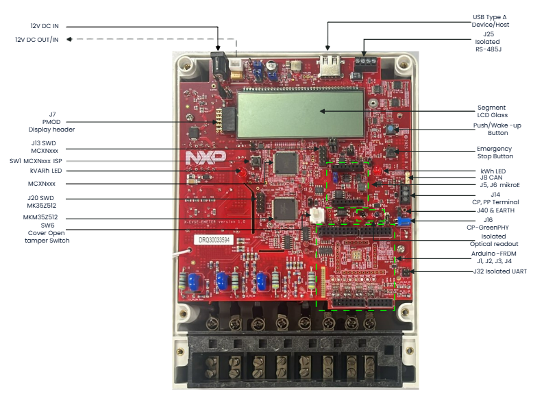
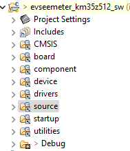
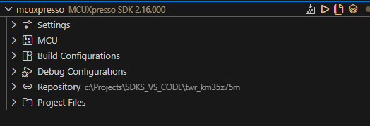

# NXP Application Code Hub

## NXP KM metrology

NXP KM metrology software makes the KM behave like an AFE. The purpose is to send data over the SPI interface to a host processor. The host processor can then use this data to calculate power quality parameters.

> ⚠️ **NOTE:** The firmware from this branch is tailored for the EVSE-EMETER board. For the software that runs with the EVSE-SIG-BRD2X check main branch

#### Boards: EVSE-EMETER
#### Categories: Analog Front End, Industrial
#### Peripherals:  ADC, SPI, AFE
#### Toolchains: MCUXpresso IDE, VS Code

## Table of Contents
1. [Software](#step1)
2. [Hardware](#step2)
3. [Setup](#step3)
4. [Results](#step4)
5. [Support](#step5)
6. [Release Notes](#step6)

## 1. Software and tools 

<ul>
    <li><a href="https://www.nxp.com/design/design-center/software/development-software/mcuxpresso-software-and-tools-/mcuxpresso-integrated-development-environment-ide:MCUXpresso-IDE">MCUXpresso IDE v11.9.1 or later</a></li>
    <li><a href="https://code.visualstudio.com/">VS Code IDE</a></li>
    <li><a href="https://marketplace.visualstudio.com/items?itemName=NXPSemiconductors.mcuxpresso">MCUXpresso for VS Code extension 25.03+</a></li>
</ul>

- SDK_26_6_000_TWR-KM35Z75M for TWR-KM35Z75M
- Clone this repo and checkout EVSE-EMETER-KM35 branch

## 2. Hardware
Mandatory hardware:
- EVSE-EMETER
- Board with exposed UART interface

>⚠️**Note**: EVSE-EMETER board contains both the MCXN947 and KM35Z75M. The purpose is to provide a complete metering solution with dual IC architecture for enhanced performance and flexibility. The KM35Z75M AFE can be replaced with alternative AFE solutions as needed.

## 3. Setup

### 3.1 Hardware assembly
There is no hardware assembly required for the EVSE-EMETER board as it comes pre-assembled with both the MCXN947 and KM35Z75M ICs.

  

To power on the EVSE-EMETER use the 12V DC IN connector. The adaptor is included in the package.
Note from the image above, the J20 SWD connector is used for programming and debugging the KM35Z75M microcontroller.

### 3.2 Software setup and flashing with MCUXpresso IDE

1. Import the project from filesystem or archive

2. After importing the project, click on it in the workspace to select it, then click on the hammer button to build it
3. To flash the project, use the SWD interface of the MKM35Z512  (J20 SWD). This can be done via an external programmer (JLINK, MCULINK)

### 3.3 Software setup and flashing with MCUXpresso for VS Code extension

1. Import the project from filesystem CTRL+SHIFT+P and select MCUXpresso: Import Multiple Project(s) and select the project folder. The MCUXpresso project will be recognized.

2. After importing the project, click on it in the workspace to select it, then right click the project and press "Pristine Build/Rebuild Project"

3. To flash the project, use the SWD interface of the MKM35Z512  (J20 SWD). This can be done via an external programmer (JLINK, MCULINK)

## 4. Results
Once the project is successfully flashed to the KM35Z512, the device will begin sampling analog signals through the ADC and transmitting the metrology data via the SPI interface to the host processor. The host processor leds will start blinking to indicate successful communication and data reception.

## 5. Support
Questions regarding the content/correctness of this example can be entered as Issues within this [GitHub repository](https://github.com/nxp-appcodehub/rd-nxp-easyevse-imxrt106x/issues).

>**Warning**: For more general technical questions regarding NXP Microcontrollers and the difference in expected functionality, enter your questions on the [NXP Community Forum](https://community.nxp.com/)

#### Project Metadata

<!----- Boards ----->

<!----- Categories ----->

<!----- Peripherals ----->

<!----- Toolchains ----->

## 6. Release Notes
| Version | Description / Update                           | Date                        |
|:-------:|------------------------------------------------|----------------------------:|
| 1.2.1     | EVSE_EMETER        | March 10th 2026 |
| 1.2.0     | Initial release on Application Code Hub        | April 3rd 2025 |